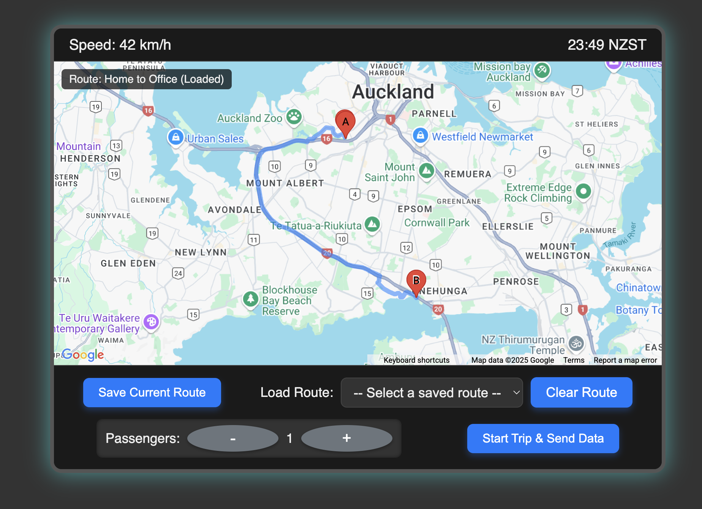

# Intelligent Transportation System (ITS) Driver Interface Unit (DIU) Prototype

## Overview

This project is a web-based prototype of a Driver Interface Unit (DIU), a key component of an Intelligent Transportation System (ITS). It demonstrates real-time traffic management, personalized routing, safety alerts, and smart city features like parking availability. The goal is to showcase how an ITS can reduce congestion, lower emissions, and enhance overall urban transport safety.

## Prototype Screenshot



## Features

* **Interactive Google Map:** Displays real-time map data.
* **Dynamic Information Display:** Shows current speed and time.
* **Passenger Count:** Adjustable passenger count for trip data.
* **Custom Route Setting:** Click on the map to define origin and destination points, and visualize the route.
* **Route Management:**
    * Save custom routes to browser's local storage with user-defined names.
    * Load previously saved routes from a dropdown menu.
    * Clear current route and markers from the map.
* **Simulated Event Alerts:**
    * **Traffic Jam:** Triggers an alert and indicates rerouting.
    * **Accident:** Triggers an emergency alert and simulates notification to emergency services.
    * **Speed Trap:** Triggers a warning and simulates speed limit enforcement.
* **Data Transmission Simulation:** "Start Trip & Send Data" button simulates sending route and passenger data to a central ITS (logged to console).

## How to Run the Prototype

To run this prototype locally, follow these steps:

1.  **Clone the Repository:**
    ```bash
    git clone [[https://github.com/YourUsername/your-repo-name.git](https://github.com/thanushkaPraveen/dui-prototype.git)]([https://github.com/YourUsername/your-repo-name.git](https://github.com/thanushkaPraveen/dui-prototype.git))
    cd dui-prototype
    ```

2.  **Obtain a Google Maps API Key:**
    * Go to the [Google Cloud Console](https://console.cloud.google.com/).
    * Create a new project (if you don't have one).
    * Enable the "Maps JavaScript API" for your project.
    * You will need to set up a billing account, even though usage typically falls within the free tier for prototypes.
    * **Important: Restrict your API Key:**
        * Under "API key restrictions," select "Websites."
        * Add the following HTTP referrers to allow the key to work locally:
            * `http://localhost/*`
            * `file:///*` (if opening `index.html` directly from your file system)

3.  **Insert API Key:**
    * Open the `index.html` file in a text editor.
    * Locate the Google Maps script tag and replace `YOUR_ACTUAL_API_KEY` with your newly obtained API key:
        ```html
        <script async defer src="[https://maps.googleapis.com/maps/api/js?key=YOUR_ACTUAL_API_KEY&callback=initMap](https://maps.googleapis.com/maps/api/js?key=YOUR_ACTUAL_API_KEY&callback=initMap)"></script>
        ```

4.  **Open in Browser:**
    * Simply open the `index.html` file in your preferred web browser (e.g., Chrome, Firefox, Edge).

## How to Use the DIU

* **Set a Route:** Click on any two points on the map to define your origin (marked 'A') and destination (marked 'B'). The route will be automatically drawn.
* **Save Current Route:** After setting a route, click the "Save Current Route" button. A prompt will appear asking you to name your route.
* **Load Saved Route:** Use the "Load Route" dropdown to select any route you've previously saved. The map will update to display that route.
* **Clear Route:** Click the "Clear Route" button to remove the current route and markers from the map.
* **Adjust Passengers:** Use the "+" and "-" buttons next to "Passengers" to change the count.
* **Start Trip & Send Data:** Click this button to simulate sending the currently displayed route and passenger count to the central ITS. A confirmation alert will appear, and data will be logged to your browser's console.
* **Simulate Events:**
    * **Simulate Traffic Jam:** Click this to trigger a simulated traffic jam alert and a marker on the map.
    * **Simulate Accident:** Click this to trigger a simulated accident alert and a marker on the map, along with a console log indicating emergency notification.
    * **Simulate Speed Trap:** Click this to trigger a simulated speed trap warning and a marker on the map, with a temporary visual change to the speed display.

## Technologies Used

* HTML5
* CSS3
* JavaScript
* Google Maps JavaScript API

## Author

**Thanushka Wickramarachchi**  
[GitHub](https://github.com/thanushkaPraveen) | [LinkedIn](https://www.linkedin.com/in/thanushkawickramarachchi)

## License

This project is open-sourced under the MIT License. See the `LICENSE` file for more details.
